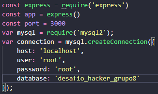

<div align=center></div>

  <h3 align="center">Desafio em Grupo - API - Grupo 8</h3>

  <p align="center"><br>
    Projeto de criação de processos HTTP.
      <br><br>
      <strong>Status do Projeto:</strong> Entrega 1 :heavy_check_mark:


<details open="open">
  <summary>Conteúdo</summary>
  <ol>
    <li>
      <a href="#sobre-o-projeto">Sobre o projeto</a>
    </li>
    <li>
      <a href="#pré-requisitos">Pré-requisitos</a>
      <ul>
        <li><a href="#instalação">Instalação</a></li>
      </ul>
    </li>
    <li>
      <a href="#usando">Usando</a>
      <ul>
        <li><a href="#testes">Testes</a></li>
      </ul>
    </li>
    <li><a href="#contato">Contato</a></li>
  </ol>
</details>


## Sobre o Projeto

Este projeto tem o objetivo de criar uma API para consultar e cadastrar objetos no banco de dados do Desafio 1 (individual). 

Para isso, trabalhamos construção de Backend utlizando as tecnologias MySQL e Node + ExpressJS, além de consultas realizadas no navegador e no Postman.


## Pré-requisitos

⚠️ [Visual Studio Code](https://code.visualstudio.com/download)

⚠️ [NodeJS](https://nodejs.org/en/download/)

- Pacotes: Express, mysql2 e bodyparser

⚠️ [MySQL](https://www.mysql.com/downloads/)

⚠️ [Postman](https://www.postman.com/downloads/) ou similar


### Instalação

1. Clonar o repositório:
   ```sh
   git clone https://github.com/farelanders/Gama_desafio_grupo8.git
   ```
2. Instalar os pacotes:
   ```sh
   npm install
   ```


## Usando

1 - Para usar e testar a API, você precisa importar o arquivo DB.sql da pasta /db_mysql no mySQL Workbench ou via console.

2 - Alterar no arquivo index.js seu usuário e senha do banco de dados: <br>



3 - Rodar o arquivo index.js via console com o comando:

   ```sh
   node index.js
   ```


4 - Rodar os testes conforme indicando abaixo.


### Testes

Com a API em funcionamento, vamos rodar os testes que foram pedidos para o desafio via navegador, Postman (ou algum similar). Estes são os testes:

|Endpoint|Operação HTTP|Explicação|Teste|
|-|-|-|-|
|/produto|GET|Retorna a lista de todos os produtos existentes. Uma lista em formato JSON contendo todos os produtos da tabela.|http://localhost:3000/api/v1/produto|
|/produto/{id}|GET|Retorna os detalhes de 1 único produto.|http://localhost:3000/api/v1/produto/:produtoId <br /><br />Produto do 10 ao 19 registrado no banco: retorna o status HTTP 200 - ok. <br />Qualquer outro ID: retorna 404 - Bad Request.|
|/produto|POST|Recebe um JSON com dados de um produto e o inclui na base de dados.|http://localhost:3000/api/v1/produto  Enviar no body por JSON({"descricao":"Camisa Ponte preta","valor":"100","estoque":"2","departamento":"2"})<br /><br />Retorna para o usuário o Objeto que foi incluído na tabela. Objeto enviado com alguma informação faltando (ex: sem descrição ou preço zerado): retorna um status HTTP 400 - Bad Request.|
|/produto/{id}|PUT|Recebe um JSON com dados de um produto, cujo ID é especificado na URL e atualiza seus dados na base de dados.| http://localhost:3000/api/v1/produto/:produtoId  Enviar no body por JSON({"descricao":"Camisa Ponte preta","valor":"100","estoque":"2","departamento":"2"})<br />Produto do 10 ao 19 registrado no banco: retorna status 200 - ok. <br />Outro ID: retorna Status 404 - Not Found. <br />Objeto incompleto ou com alguma propriedade inválida (preço zerado): retorna status HTTP 400 - Bad Request. |
|/departamento|GET|Retorna a lista de todos os departamentos|HTTP://localhost:3000/api/v1/departamento|
|/departamento/{id}|GET|Retorna o departamento e a lista de produtos que estão associadas a ele.|HTTP://localhost:3000/api/v1/departamento/:departamentoId <br /><br />ID do 1 ao 5 registrado no banco: retorna status 200 - ok. Qualquer outra ID: retorna status 404 - Not Found.|


## Contato

Milena Maganin - [Linkedin](https://www.linkedin.com/in/milenamaganin/) - mimaganin@gmail.com \
Marcos Travagin - [Linkedin](https://linkedin.com/in/marcos-antonio-travagin-41515985) - marcostravagin@outlook.com \
Jacson Oliveira Santos - jacson.oliveira.santos@gmail.com

Link do projeto: [https://github.com/farelanders/Gama_desafio_grupo8](https://github.com/farelanders/Gama_desafio_grupo8)

